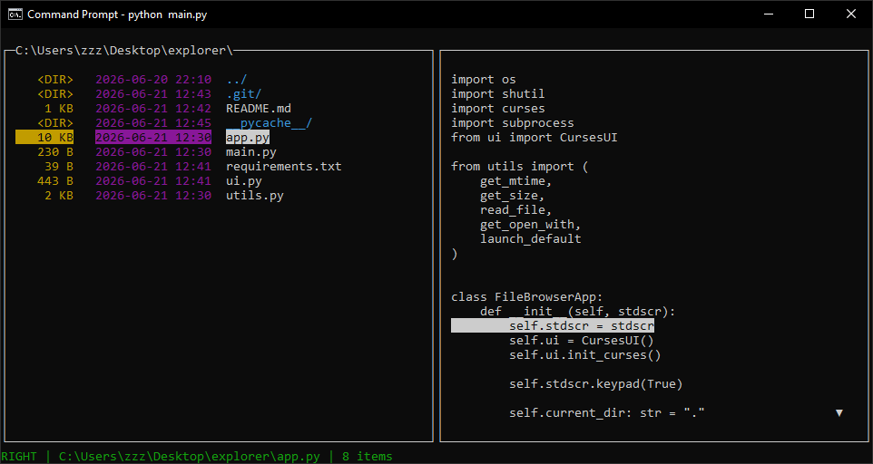

# Curses File Explorer



A terminal-based, dual-panel file explorer built in Python using the `curses` library. 

This explorer provides a classic, keyboard-driven interface (similar to Midnight Commander or Norton Commander) for browsing directories, previewing files, copying, pasting, and deleting files or directories.

---

## Features

- **Dual-Panel Layout**: Navigate your filesystem with a side-by-side view.
- **File Previews**: Select a file to view its text contents directly in the right panel.
- **Dynamic File Operations**: Copy, paste, and delete files/folders directly from the terminal.
- **"Open With" Dialog**: Integration with the Windows Registry to suggest and launch programs associated with specific file extensions.
- **Built-in Help Menu**: Access list of keybindings instantly.

---

## Keyboard Controls

| Key | Action |
| --- | --- |
| `q` | Quit the application |
| `ENTER` | Open selected file or folder |
| `UP` / `DOWN` | Navigate items in the active panel / scroll file preview |
| `LEFT` / `RIGHT` | Switch focus between panels |
| `c` | Copy selected file |
| `v` | Paste copied file (automatically handles name collisions) |
| `d` | Delete selected file or folder (requires confirmation) |
| `x` | Go to directory path copied in the clipboard (does nothing if invalid) |
| `h` | Toggle the Help menu |
| `ESC` | Close dialogs / cancel actions |

---

## Requirements

- Python 3.x
- On Windows: `windows-curses` library (automatically installed via requirements)

---

## Installation & Setup

1. **Clone the repository**:
   ```bash
   git clone https://github.com/zzzuhn/python-file-explorer.git
   cd explorer
   ```

2. **Install dependencies**:
   ```bash
   pip install -r requirements.txt
   ```

3. **Run the file explorer**:
   ```bash
   python main.py
   ```